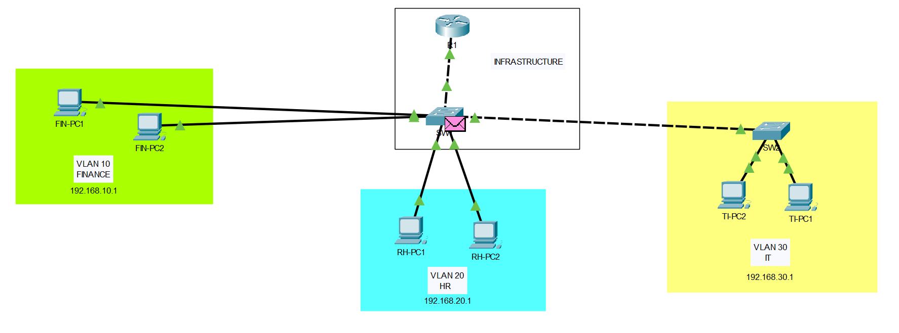

# Small Enterprise Network

## Overview

This project simulates a small enterprise network environment using Cisco Packet Tracer.

The topology includes:
- VLAN segmentation
- Inter-VLAN routing
- DHCP services
- Extended ACL implementation
- Router-on-a-stick architecture
- Management VLAN
- Basic switch hardening

---

## Network Topology



---

## VLAN Structure

| VLAN | Department | Network | Gateway |
|------|-------------|---------|----------|
| 10 | Finance | 192.168.10.0/24 | 192.168.10.1 |
| 20 | HR | 192.168.20.0/24 | 192.168.20.1 |
| 30 | IT | 192.168.30.0/24 | 192.168.30.1 |
| 99 | Management | 192.168.99.0/24 | 192.168.99.1 |

---

## Features

- VLAN segmentation
- 802.1Q trunking
- Router-on-a-stick
- DHCP configuration
- Inter-VLAN routing
- Extended ACL security policy
- Port security
- Switch hardening
- Management VLAN

---

## Security Policy

- HR department cannot access Finance VLAN
- IT department has full access
- Unused ports are administratively disabled
- Basic port security enabled

---

## Technologies Used

- Cisco Packet Tracer
- Cisco IOS
- VLANs
- DHCP
- ACLs
- Port Security
- Layer 2 Switching
- Inter-VLAN Routing

---

## Project Structure

```plaintext
small-enterprise-network/
│
├── topology/
├── packet-tracer/
├── configs/
└── docs/
```
